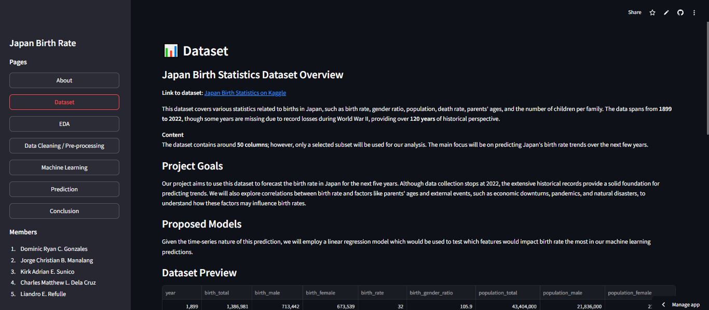

# Japan Birth Rate Dashboard using Streamlit

A data-driven web application to analyze and predict Japan's birth rate trends using historical data from 1899 to 2022. This project applies **Exploratory Data Analysis (EDA)**, **Time Series Forecasting**, and **Linear Regression Modeling** to identify key factors influencing birth rates and project future rates over the next five years.

### 🔗 Links:

- 🌐 [Streamlit Link](https://group4-css145-proposal3-hzvkwntqtmldcgqtg2bgxt.streamlit.app/)
- 📗 [Google Colab Notebook](https://colab.research.google.com/drive/1i7ifs7KNyGwueQwB-WqFf-4zKZrXHKAE?usp=sharing)

### 📊 Dataset:

- [Japan Birth Statistics on Kaggle](https://www.kaggle.com/datasets/webdevbadger/japan-birth-statistics)

### 📖 Pages:

1. `Dataset` - Overview of Japan's birth statistics, including birth rates, parent ages, gender ratios, and factors like historical and calamity impacts on birth trends.
2. `EDA` - Exploratory analysis on birth rate fluctuations and demographic patterns over the years, with visualizations highlighting correlations between key factors.
3. `Data Cleaning / Pre-processing` - Cleaning and transforming historical data for accurate modeling, handling missing values, and selecting relevant columns.
4. `Machine Learning` - Applied Linear Regression to predict birth rates based on factors like year, total population, and total births. The model provides insights into how these variables impact birth rate over time.
5. `Prediction` - Interactive prediction feature to estimate Japan's future birth rate, providing insights based on historical patterns and influential factors.
6. `Conclusion` - Summarized insights on Japan's birth trends, key factors, and model performance in predicting future rates.

### 💡 Findings / Insights

Through exploratory data analysis and training of a classification model (`Linear Regression Modelling`) on the **Japan Birth Statistics Dataset**, the key insights and observations are:

#### 1. 📊 Dataset Overview:

The dataset, spanning from 1899 to 2022, provides an extensive look into Japan's birth rates and demographics, including variables such as population size and birth totals. However, historical events like World War II resulted in some missing years, though these gaps were addressed during data cleaning.

Statistical analysis of the dataset shows a historical average of 1,641,856 births per year with notable fluctuations, especially due to cultural and external factors influencing birth rates in different decades.

#### 2. 📉 Exploratory Data Analysis (EDA):

The EDA highlighted Japan’s decreasing birth rate over time, with a gradual increase until the 1980s, followed by a steep decline. Various historical and cultural events, such as World Wars and superstitions (e.g., the Hinoe-Uma superstition in 1966), contributed to birth rate dips.

Birth totals, separated by gender, showed that male births were consistently higher than female births, a trend aligned with biological norms observed globally.

#### 3. 📈 Model Training and Prediction (Linear Regression):

We trained a Linear Regression model using year, population total, and birth total as independent variables to predict the birth rate.
Model performance metrics included Mean Squared Error (MSE) and R-squared (R²). The model achieved an MSE of 1.1731 and an R² of 0.9899, indicating a strong fit and high predictive accuracy for Japan’s birth rate based on historical data.

#### 4. 🔍 Model Insights and Interpretation:

The high R² value suggests that the linear model effectively captures trends and variability in Japan’s birth rate using selected features. However, the model's slight overestimation on test data implies there may be additional factors impacting birth rates, such as economic conditions and cultural shifts, not included in the current dataset.

Visualizations of the actual versus predicted birth rates affirmed the model’s alignment with historical trends, although further improvements could include adding more nuanced demographic or economic indicators.

#### 5. 📊 Predictive Outlook and Future Considerations:

Projections based on this model suggest a continued decline in Japan's birth rate. This aligns with current demographic trends reported globally, where many developed nations are experiencing declining birth rates.
Future studies might enhance predictive accuracy by incorporating additional data points, such as economic conditions, government policies, and social factors, to further understand the declining birth rate and potentially identify policy interventions.

##### **Summing up:**

Through our analysis of Japan's birth rate dataset and linear regression modeling, we identified significant historical trends and developed a model that provides high accuracy in predicting future birth rates. The insights derived from this study underscore the complexity of birth rate dynamics and highlight the importance of combining demographic, economic, and cultural factors for more comprehensive forecasting.

## Group Members

### Dominic Ryan C. Gonzales

- **ID**: 2023180061
- **GitHub**: [ryang1006](https://github.com/ryang1006)

### Jorge Christian B. Manalang

- **ID**: 2023104718
- **GitHub**: [christian-manalang](https://github.com/christian-manalang)

### Kirk Adrian E. Sunico

- **ID**: 2023107221
- **GitHub**: [kirkadrian](https://github.com/kirkadrian)

### Charles Matthew L. Dela Cruz

- **ID**: 2023104218
- **GitHub**: [charles-delacruz](https://github.com/charles-delacruz)

### Liandro E. Refulle

- **ID**: 2023109170
- **GitHub**: [liandrorefulle](https://github.com/liandrorefulle)
